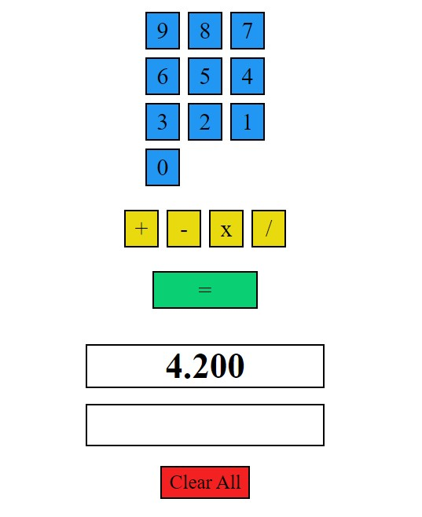

# Calculator Application

This application performs simple arithmetic such as addition, subtraction, division, and multiplication. Continuous calculation is possible and the result is displayed as the calculation is entered.

## 

## Features

- perform addition, subtraction, multiplication, division
- enter integers and see result in float format
- clear results to reset the calculator

## 🛠 Skills
Javascript, HTML, CSS

## Author
- [@davidtcliffe](https://github.com/davidcliffe)
